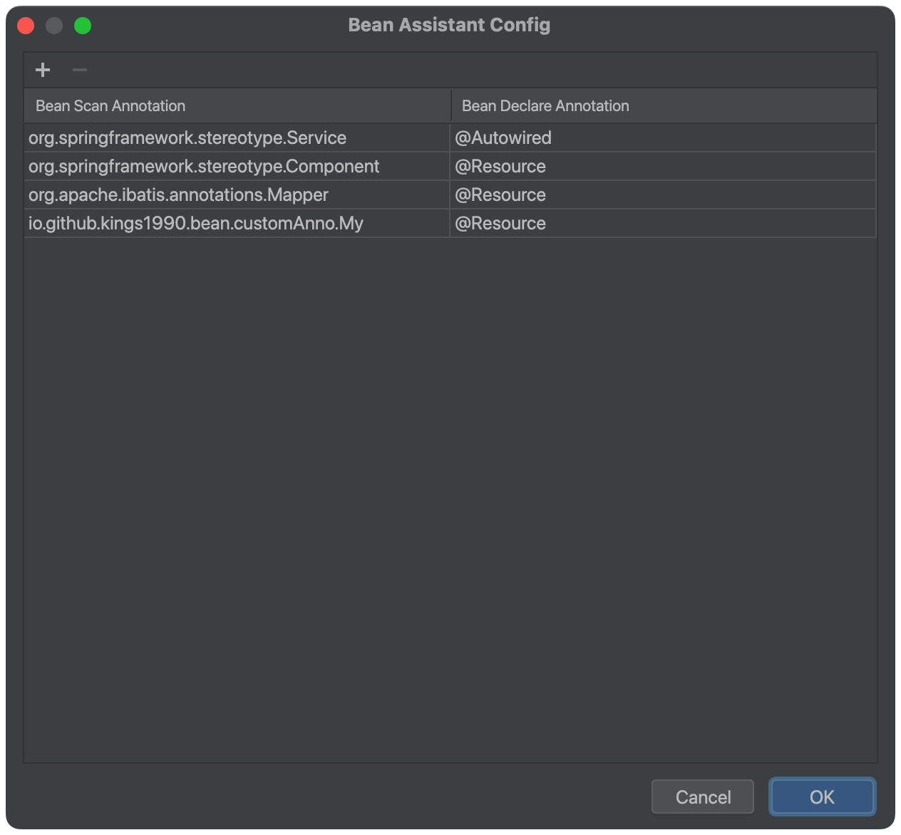

# bean-assistant-doc

Bean Assistant is a plugin that helps you to define the bean more easily. You need to only type the bean name, plugin will help you to
generate the bean definition automatically.

## Features
You can customize the strategy in `Tools -> Bean Assistant`

## Custom config

## Tip
It is suggested to check the following options in `Settings -> General -> Auto Import` to make the plugin work better.

